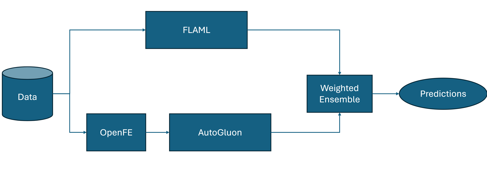

# [Team AutoML Grandmasters] Second AutoML Grand Prix Competition Write-Up

See [here](https://www.kaggle.com/competitions/playground-series-s4e6/discussion/509631) for the detailed post-competition write-up.

This repository additionally provides the used code in an aggregated form (`main.py`), the required requirements (`requirements.txt`), and an additional overview picture (`overview.png`).

## Reproducing Our Submission
<!---
A link to a code repository with complete and detailed instructions for reproducing the results obtained is recommended for all participants and mandatory for winners to claim the prizes.
-->

To reproduce (not replicate as this is essentially impossible given different hardware and time-based randomness) our submission, follow these steps:
* Install the required python packages specified in `requirements.txt`. 
* Download the test, train, and the original data. Obtain the test and train data from Kaggle. You can obtain the original data from the [UCI repositroy](https://archive.ics.uci.edu/dataset/697/predict+students+dropout+and+academic+success).
* Add the specific paths to the data in the `main.py` file.
* Run the `main.py` file.

## Main Contributions List
<!--- An itemized list of your main contributions and critical elements of success. Suggestions: Contrast your proposed method with others, e.g., in terms of computational or implementation complexity, parallelism, memory cost, and theoretical grounding.
-->
* Using AutoGluon with the original data, with new features from OpenFE, ordinal features as categorical features, only neural networks as stacking models, and a custom early stopping loss function.
* Building a weighted ensemble of the lottery ticket and our AutoGluon models.

## Detailed Methodology
<!--- A detailed description of methodology. Expand and explain your contributions in more detail. The explanations must be self-contained and one must be able to reproduce the approach by reading this section. You can explain and justify the approach by any means, e.g. citations, equations, tables, algorithms, platforms and code libraries utilized, etc. A detailed explanation of the architecture, preprocessing, loss function, training details, hyper-parameters, etc. is expected.
-->
See [here](https://www.kaggle.com/competitions/playground-series-s4e6/discussion/509631) for more details.

## Workflow Diagram
<!--- A representative image / workflow diagram of the method to support additional description. -->

